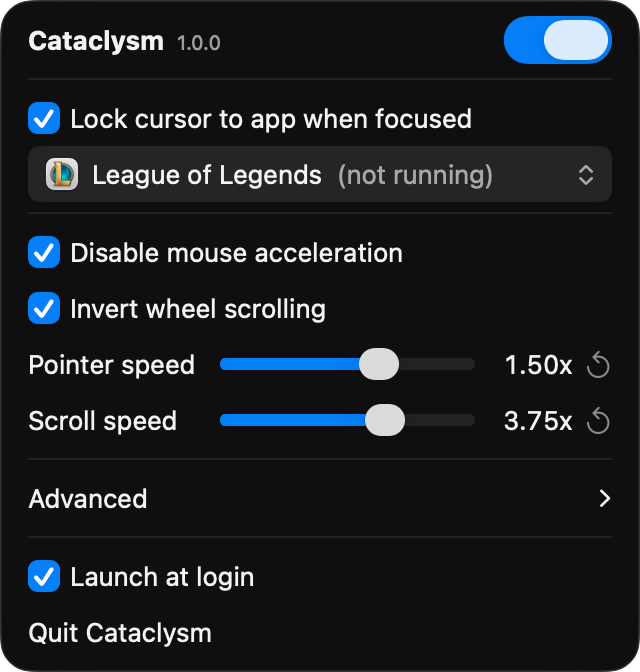

# Cataclysm

Cataclysm is a menu bar app that fixes mouse interactions for League of Legends and other games on macOS. It locks the cursor to the game in windowed mode, disables pointer acceleration, and inverts scroll directions. Download at [akshath.me/cataclysm](https://akshath.me/cataclysm) (needs macOS 13 or later, supports both Apple silicon and Intel).

## First launch

macOS blocks the first launch because Cataclysm is not in Apple's paid developer program (I want to keep it free). Once per Mac:

1. Drag Cataclysm to Applications and open it. On the "Cataclysm" Not Opened dialog, click **Done**.
2. System Settings > Privacy & Security > scroll to Security > **Open Anyway**.
3. Click **Open Anyway** again, then enter your password.
4. Grant Accessibility when Cataclysm asks so that it is able to detect mouse events. Nothing works until it is granted.

On macOS 13 and 14 steps 1 to 3 collapse into one: right-click Cataclysm in Applications, choose Open, then click Open again.

Everything is in the menu bar dropdown. Cursor lock is only enforced while the game is focused (so you can tab out), but if you need it, `⌥⌘L` toggles the cursor lock even in-game.

## What it fixes

- **Cursor lock.** In a window, an edge flick mid-fight slides the cursor off the game and a click lands on the desktop or the app behind. Cataclysm uses the capture technique virtual machines use: it disconnects the hardware mouse from the on-screen cursor and places the cursor itself on every movement, clamped to the game window, so it cannot cross the edge even for a frame. In windowed mode, the clamp follows the window's rounded corners so a click in the corner gap cannot reach the app behind. In borderless mode and in the game's own fullscreen mode the corners are sharp and the clamp is the plain rect, so the minimap corner stays reachable. Native macOS fullscreen is left alone because there the game confines the cursor itself. The lock engages only while the chosen app is frontmost and releases the instant it is not: `⌘⇥` out and the cursor is free. While it is engaged, a second display is unreachable by design.
- **Pointer acceleration.** macOS scales cursor distance by how fast you moved. Cataclysm turns that off so the same hand motion always moves the cursor the same distance.
- **Scroll direction.** Out of the box the wheel zooms the wrong way. Cataclysm inverts it (and, under Advanced, horizontal scrolling) and can scale the speed. Trackpads are detected and left untouched.

Cataclysm only clamps and rewrites your own input. It never generates clicks, movement or any automation.

## Crash recovery

If Cataclysm is force-quit or crashes at the wrong moment, the cursor can be left disconnected from the mouse. A watcher registered as a login item reconnects it within about a second; if launchd has to restart the watcher too, the worst case is around ten seconds. The dropdown warns when the watcher is not registered and points at Login Items. If the cursor is still stuck after that, log out and back in.

## Uninstall

Uncheck "Launch at login" and quit from the dropdown, then move Cataclysm to Trash. Quitting restores acceleration and reconnects the cursor. Remove any leftover Cataclysm entry under System Settings > General > Login Items. If `~/Library/LaunchAgents/io.github.heyitaki.cataclysm.watch.plist` exists (written when the bundled watcher cannot be registered or never starts), run `launchctl bootout gui/$(id -u)/io.github.heyitaki.cataclysm.watch` and delete it.

## Building from source

Needs the Xcode command line tools and a code-signing identity named `Cataclysm` in the keychain (self-signed is fine; override with `IDENTITY=`). `make` builds `build/Cataclysm.app`, `make test` runs the tests. `make dmg VERSION=x.y.z` produces, in `build/`, `Cataclysm-x.y.z.dmg` (unsigned image, signed app inside), `Cataclysm.dmg` (byte-identical, version-stable name) and `Cataclysm-x.y.z.zip` (the updater's archive); `appcast.xml`, the updater's feed, is built separately. Running the bundled binary with `--dump-scroll` logs each raw scroll event and the filter's decision to stdout.

The download redirect and heartbeat receiver live in [`worker/`](worker/) and need Node and npm. `cd worker && npm install && npm test` runs its tests (the report script's tests also need `bash`, `curl` and `jq`); `npm run check` is a dry-run deploy and `npm run deploy` publishes through the machine's `wrangler login` session.

## License

MIT
